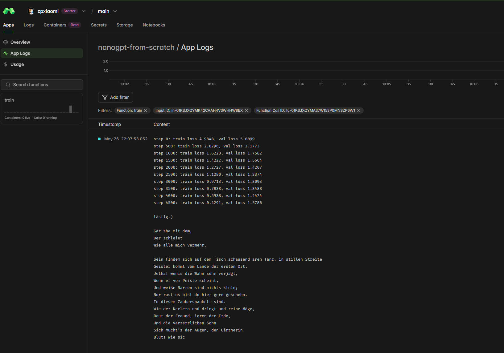
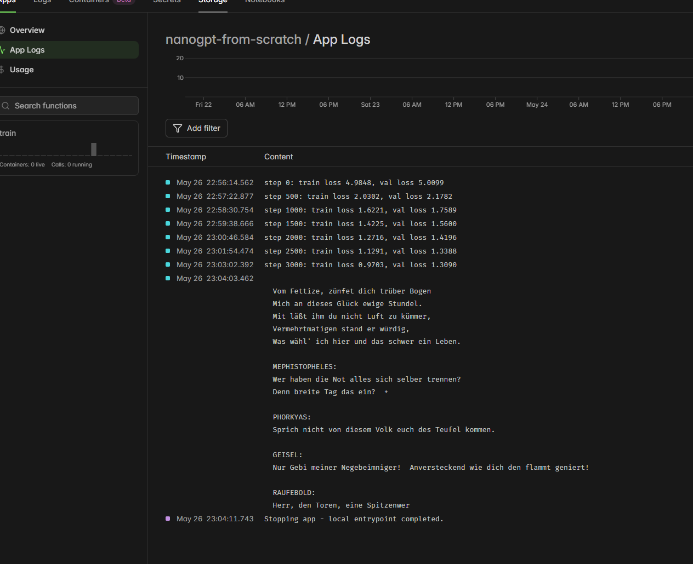

# NanoGPT from Scratch

A from-scratch implementation of a GPT language model in Python, built by following along with Andrej Karpathy's tutorial.

## Goal

Train a character-level language model on a given text corpus so that it can generate new text that resembles the style and content of the original input — coherent enough to feel like it belongs, even if not perfectly meaningful.

## Attribution

This project is based on the video:

**Let's build GPT: from scratch, in code, spelled out**
by [Andrej Karpathy](https://github.com/karpathy)
https://www.youtube.com/watch?v=kCc8FmEb1nY

## Project Structure

- `bigram.py` — initial bigram language model implementation
- `bigram_notebook.py` — annotated notebook-style version of the bigram model
- `model.py` — GPT model definition, hyperparameters, vocab, and decode helper
- `gpt.py` — full transformer training script (runs via `python gpt.py`)
- `inference.py` — load a saved checkpoint and generate text
- `run.py` — Modal entrypoint for remote GPU training (see below)
- `data/` — training text corpus (Goethe's Faust)

## Remote Training with Modal

Training is run on [Modal](https://modal.com) to access GPU hardware (A100). `run.py` defines the Modal app that:

1. Builds a remote image with the required dependencies (`torch`, `numpy`) and uploads the training script and data.
2. Runs the training script on an A100 GPU with a 30-minute timeout.
3. Returns the saved checkpoint (`checkpoint_step3000.pt`) back to your local machine.

To run training remotely:

```bash
pip install modal
modal run run.py
```

The checkpoint will be saved locally as `checkpoint_step3000.pt` after the run completes.

## Training Results

### Run 1 — 5000 steps (overfitting observed)

The first run trained for 5000 steps. The model improved steadily up to around step 3000 (val loss ~1.31), but after that the training loss continued to drop while the validation loss started rising — a clear sign of overfitting.

| Step | Train Loss | Val Loss |
|------|-----------|----------|
| 0    | 4.90      | 5.01     |
| 1000 | 1.62      | 1.76     |
| 2000 | 1.27      | 1.42     |
| 3000 | 0.97      | 1.31     |
| 4000 | 0.59      | 1.44     |
| 4500 | 0.43      | 1.58     |



### Run 2 — 3000 steps (checkpoint saved)

The second run stopped at step 3000, where the validation loss was at its best (~1.31). The checkpoint was saved and downloaded locally via Modal.

| Step | Train Loss | Val Loss |
|------|-----------|----------|
| 0    | 4.98      | 5.01     |
| 1000 | 1.62      | 1.76     |
| 2000 | 1.27      | 1.42     |
| 3000 | 0.97      | 1.31     |



### Generated Output

The training corpus is Goethe's *Faust* in German. The model learned to generate text that resembles the style of the original — including dramatic dialogue with character names like `MEPHISTOPHELES`, `PHORKYAS`, `GEISEL`, and `RAUFEBOLD`, poetic line breaks, and plausible German vocabulary. The words are not always real German but the rhythm, structure, and feel of the original play comes through clearly.

```
Vom Fettize, zünfet dich trüber Bogen
Mich an dieses Glück ewige Stundel.
Mit läßt ihm du nicht Luft zu kümmer,
Vermehrtmatigen stand er würdig,
Was wähl' ich hier und das schwer ein Leben.

MEPHISTOPHELES:
Wer haben die Not alles sich selber trennen?
Denn breite Tag das ein?

PHORKYAS:
Sprich nicht von diesem Volk euch des Teufel kommen.
```

## Setup

```bash
python -m venv .venv
source .venv/bin/activate
pip install torch
```
